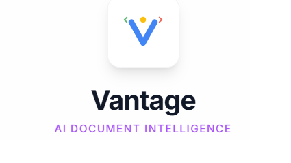

# Vantage - AI Document Intelligence



**Vantage** is a cutting-edge AI editorial assistant designed to transform Google Docs into dynamic, intelligent workspaces. Leveraging the power of **Google's Gemini 3.0 and 2.5 models**, Vantage acts as a proactive collaborator, offering deep structural rewrites, real-time voice discussions, fact-checking, and instant visual asset generation.

## 🚀 Features

-   **🧠 Deep Polish (Gemini 3.0 Pro)**: Utilizes advanced "Thinking" capabilities to analyze document structure and tone, offering world-class rewrites and stylistic critiques.
-   **🎨 Nano Banana (Visual Intelligence)**: Context-aware image suggestions powered by Gemini 3.0 Pro, instantly generated using **Gemini 2.5 Flash Image**.
-   **🎙️ Voice Review (Live API)**: Talk to your document in real-time. A low-latency, multimodal voice interface allows for hands-free brainstorming and summarization.
-   **✅ Fact Checking (Grounding)**: Verifies claims against Google Search to ensure accuracy and provides source links.
-   **💬 Smart Collaboration**: Suggests resolutions for existing comments and proactively recommends new improvements for clarity and impact.

## 🏗️ Architecture

Vantage is built with a modern frontend stack and direct integration with Google's GenAI SDK.

-   **Frontend Framework**: React 19 with TypeScript.
-   **Styling**: Tailwind CSS for a responsive, beautiful UI.
-   **AI SDK**: `@google/genai` for direct interaction with Gemini models.
-   **Audio Processing**: Web Audio API for real-time PCM streaming to the Gemini Live API.

### AI Model Strategy

Vantage matches the specific capabilities of Gemini models to the user's task:

| Feature | Model | Reason |
| :--- | :--- | :--- |
| **Chat & Basic Logic** | `gemini-2.5-flash` | Low latency, high throughput for standard interactions. |
| **Deep Polish** | `gemini-3-pro-preview` | Utilizes the **Thinking** budget (16k tokens) for complex reasoning and editorial judgment. |
| **Visual Context** | `gemini-3-pro-preview` | Understands document nuance to write highly detailed image prompts. |
| **Image Generation** | `gemini-2.5-flash-image` | Fast, high-quality image generation (Nano Banana) for visual assets. |
| **Voice Mode** | `gemini-2.5-flash-native-audio` | Native audio-to-audio streaming for ultra-low latency conversations. |

## 🛠️ How to Run

### Prerequisites

1.  Node.js (v18+)
2.  A Google Cloud Project with the Gemini API enabled.
3.  An API Key from [Google AI Studio](https://aistudio.google.com/).

### Installation

1.  **Clone the repository**
    ```bash
    git clone https://github.com/yourusername/vantage.git
    cd vantage
    ```

2.  **Install dependencies**
    ```bash
    npm install
    ```

3.  **Configure Environment**
    Create a `.env` file in the root directory and add your API key.
    *(Note: In a production environment, handle keys securely via backend proxies)*.
    ```env
    API_KEY=your_gemini_api_key_here
    ```

4.  **Run the Development Server**
    ```bash
    npm run dev
    ```

5.  **Open in Browser**
    Navigate to `http://localhost:5173`.

> **Note:** For the "Talk to Doc" feature, ensure you grant microphone permissions when prompted.

## 🤝 How to Contribute

We welcome contributions to make Vantage even smarter!

1.  **Fork** the repository.
2.  Create a **Feature Branch** (`git checkout -b feature/AmazingFeature`).
3.  Commit your changes (`git commit -m 'Add some AmazingFeature'`).
4.  Push to the branch (`git push origin feature/AmazingFeature`).
5.  Open a **Pull Request**.

## 📄 License

Distributed under the MIT License.

```
